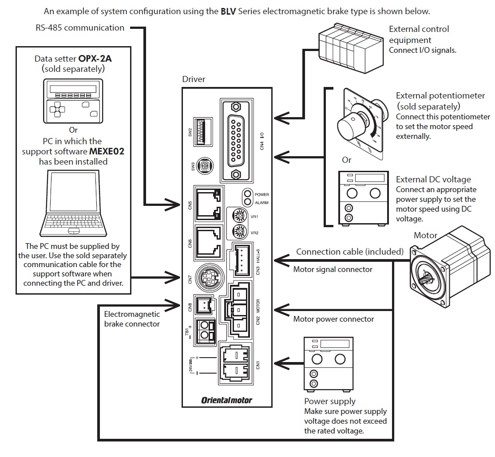
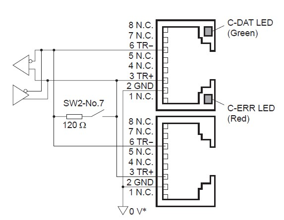
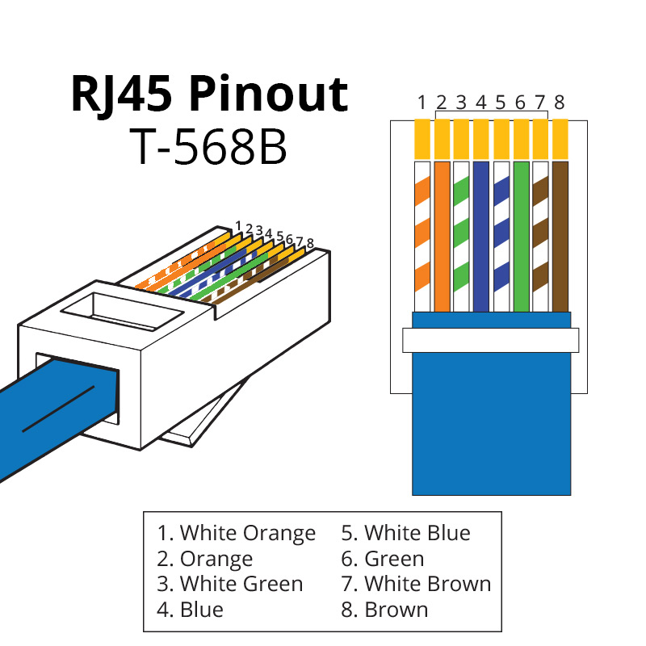
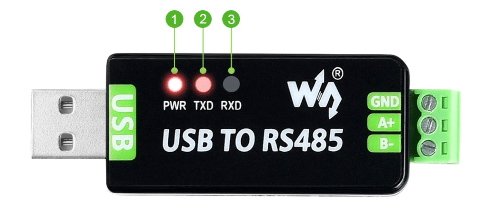
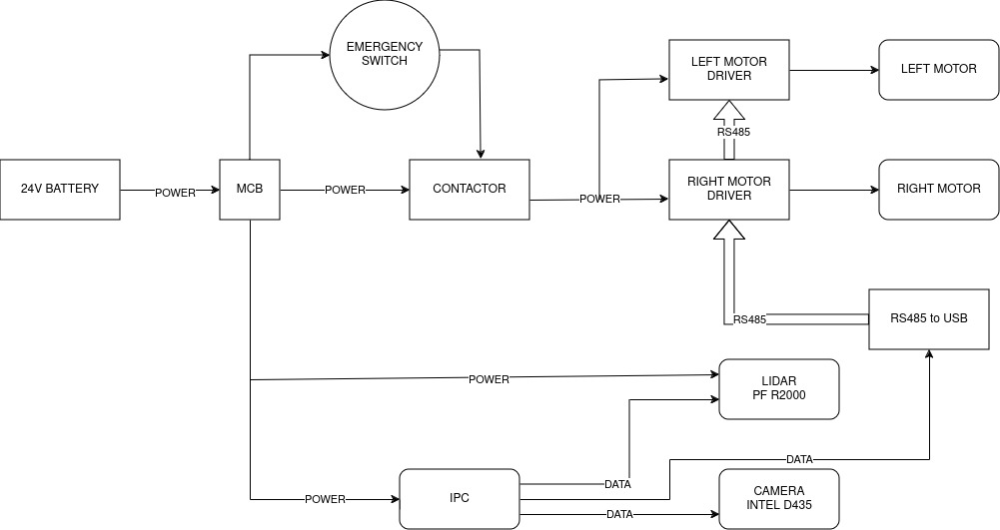

# Optimus-AMR
Differential drive bot using oriental motors(BLV620km-gfs)

## Motor Driver Connections

Connections required:  
CN1: connected to 24V DC power source  
CN2, CN3, CN8 : connected to motor  
CN5 : connected to RS485-USB converter via ethernet cable.  

##  Connection to RS485-USB conerter
[RS485-USB Converter used](https://www.waveshare.com/usb-to-rs485.htm)

connections at converter end:  
GND(converter) - wire2{orange}(Ethernet cable)  
A+(converter) - wire3{green striped}(Ethernet cable)  
B-(converter) - wire6{green}(Ethernet cable)  
## CIRCUIT DIAGRAM FOR AMR

## AMR SETUP
Step1 : Turn ON the MCB placed on the left side of AMR.
<!---->
Step2 : Turn ON IPC placed at the back of AMR.
<!---->
Step3 : Remotely connect to mira-amr over SSH.(refer to WIFI setup section in readme)
      
      ssh mira-amr@192.168.193.220

